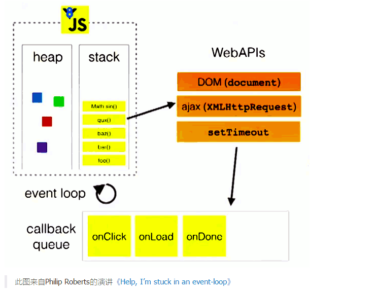
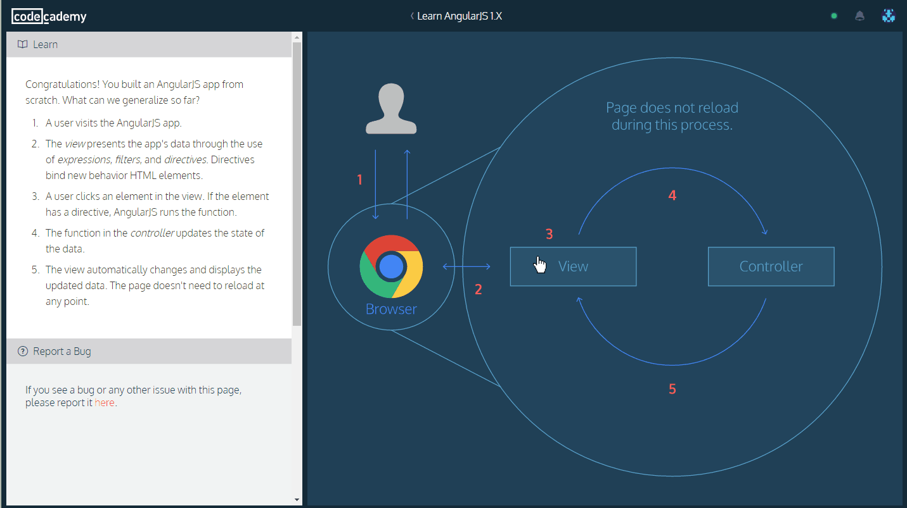

# AngularJS
<ol>
	<li><a href="#AngularJS-basic">AngularJS基础</a>
		<ul>
			<li><a href="#AngularJS-basic-1">AngularJS工作原理</a>
      </li>
      <li><a href="#AngularJS-basic-2">My First App</a>
        <!-- <ul>
          <li><a href="#Angular-basic-2.1">Angular工作流程</a></li>
        </ul> -->
      </li>
      <li><a href="#AngularJS-basic-3">Directive</a></li>
			<li><a href="#AngularJS-basic-4">Services</a></li>
    </ul>
  <li><a href="#AngularJS-QA">AngularJS常错</a></li>
	<li><a href="#AngularJS-tricks">AngularJS Tricks</a>
		<ul>
			<li><a href="#AngularJS-tricks-1">选择栏切换样式</a></li>
		</ul>
	</li>
</ol>
<a id="AngularJS-basic"></a>
## AngularJS基础
<a id="AngularJS-basic-1"></a>
### AngularJS 工作原理

当你用浏览器去访问index.html的时候，浏览器依次做了如下一些事情：

- 加载html，然后解析成DOM；
- 加载angular.js脚本；
- AngularJS等待DOMContentLoaded事件的触发；
- AngularJS寻找ng-app指令，根据这个指令确定应用程序的边界；
- 使用ng-app中指定的模块配置$injector；
- 使用injector创建injector创建compile服务和$rootScope；
- 使用compile服务编译DOM并把它链接到compile服务编译DOM并把它链接到rootScope上；
- ng-init指令对scope里面的变量name进行赋值；
- 对表达式{{name}}进行替换，于是乎，显示为“Hello World!”     
整个过程可以用这张图来表示：


<a id="AngularJS-basic-2"></a>
### My First App
This is our typical workflow when making an AngularJS app:

- Create a module, and use ng-app in the view to define the application scope.
- Create a controller, and use ng-controller in the view to define the controller scope.
- Add data to $scope in the controller so they can be displayed with expressions in the view.

##### 1. In app.js, type in the contents exactly as you see here:

```
var app = angular.module("myApp", []);
```
##### 2. Open up index.html. Modify the <body> tag so it looks like this:
- The ``` ng-app ``` is called a directive.

```
<body ng=app="myApp">
```

##### 3. Open up js/controllers/MainController.js. Type in the contents exactly as you see here:

```
app.controller('MainController',['$scope',function($scope){
    $scope.title='Top Sellers in Books';
  }]);
```

##### 4. Go to index.html. Modify the``` <div class="main">``` tag so it looks like this:

```
<div class="main" ng-controller='MainController'>

```

##### 5. In index.html inside ```<div class="main">```, modify the ```<h1>``` element so it looks like this:
- Inside``` <div class="main">``` we accessed``` $scope.title``` using ```{{ title }}```. This is called an expression. Expressions are used to display values on the page.

```
<div class="main" ng-controller='MainController'>
  <h1>{{title}}</h1>
</div>
```

#### 使用 filter
Let's do a quick review:

- A module contains the different components of an AngularJS app
- A controller manages the app's data
- An expression displays values on the page
- A filter formats the val
ue of an expression

```
$scope.product={
  name:'The Book of Trees',
  price:19,
  pubdate:new Date('2014','03','08')
};
```
```
<div class="thumbnail">
  
  <p class="title"> {{ title | uppercase }}</p>
  <p class="price">{{product.price | currency}} </p>
  <p class="date">{{product.pubdate | date}} </p>
</div>
```

#### 使用 ng-repeat
- 改写products为数组
- 添加ng-repeat

```
$scope.products=[{
  name:'The Book of Trees',
  price:19,
  pubdate:new Date('2014','03',08),
  cover: 'img/the-book-of-trees.jpg'
},
{
  name: 'Program or be Programmed',
  price: 8,
  pubdate: new Date('2013', '08', '01'),
  cover: 'img/program-or-be-programmed.jpg'
}];
```

```
<div ng-repeat="product in products" class="col-md-6">
  <div class="thumbnail">
    
    <p class="title"> {{ title | uppercase }}</p>
    <p class="price">{{product.price | currency}} </p>
    <p class="date">{{product.pubdate | date}}
    <div class="rating">
      <p class="likes" ng-click="plusOne($index)">{{product.likes}}</p>
    </div>
    </p>
  </div>
</div>
```

#### 编写方法
- 添加likes
- 编写方法
- 添加 ng-click

Each time you click on the number of likes, the number goes up. How does it work?

- The ng-click is a directive. When <p class="likes"> is clicked, ng-click tells AngularJS to run the plusOne() function in the controller.
- The plusOne() function gets the index of the product that was clicked, and then adds one to that product's likes property.

Notice that the plusOne() doesn't interact with the view at all; it just updates the controller. Any change made to the controller shows up in the view.

```
$scope.products=[{
  name:'The Book of Trees',
  price:19,
  pubdate:new Date('2014','03',08),
  cover: 'img/the-book-of-trees.jpg' ，
  likes:0
},
{
  name: 'Program or be Programmed',
  price: 8,
  pubdate: new Date('2013', '08', '01'),
  cover: 'img/program-or-be-programmed.jpg' ，
  likes:0
}];
```
```
$scope.plusOne=function(index){
  $scope.products[index].likes+=1;
};
```
```
<p class="likes" ng-click="plusOne($index)">
```

#### 总结



<a id="AngularJS-basic-3"></a>
### Directive
- 建立Directive名为appInfo
- 在index.html引入文件
- 在appInfo.html中编写appInfo的内容
- 在index.html中引用app-info

#### 1. In the new file js/directives/appInfo.js, type in this code:

```
app.directive('appInfo', function() {
  return {
    restrict: 'E',
    scope: {
      info: '='
    },
    templateUrl: 'js/directives/appInfo.html'
  };
});
```
#### 2. Include this new JavaScript file in index.html in line 48 as a ```<script>``` element.
```
<!-- Directives -->
<script src="js/directives/appInfo.js"></script>
```
#### 3. In the new file js/directives/appInfo.html. Type in this HTML to display an app's info:

```

<h2 class="title">{{ info.title }}</h2>
<p class="developer">{{ info.developer }}</p>
<p class="price">{{ info.price | currency }}</p>
```

#### 4. In index.html, replace the contents of the first .card div with the new <app-info> element:

```
<div class="card">
  <app-info info="move"></app-info>
</div>
```
附录：
js/controllers/MainController.js
```
app.controller('MainController', ['$scope', function($scope) {
  $scope.apps = [
  	{
    	icon: 'img/move.jpg',
    	title: 'MOVE',
    	developer: 'MOVE, Inc.',
    	price: 0.99
  	},
 	 	{
    	icon: 'img/shutterbugg.jpg',
    	title: 'Shutterbugg',
    	developer: 'Chico Dusty',
    	price: 2.99
  	},
 	 	{
    	icon: 'img/gameboard.jpg',
    	title: 'Gameboard',
    	developer: 'Armando Perez',
    	price: 1.99
  	},  
 	 	{
      icon: 'img/forecast.jpg',
      title: 'Forecast',
      developer: 'Forecast',
      price: 1.99
    }
	]
}]);
```
What did we just do? We wrote code to teach the browser a new HTML element ```<app-info>```, and used it in the view to display each app's details.

First in ```js/directives/appInfo.js```, we made a new directive. We used``` app.directive ```to create a new directive named ```'appInfo'```. It returns an object with three options:

- ```restrict ```specifies how the directive will be used in the view. The ```'E' ```means it will be used as a new HTML element.
- ```scope``` specifies that we will pass information into this directive through an attribute named ```info```. The ```=``` tells the directive to look for an attribute named ```info``` in the ```<app-info>``` element, like this:
```
 <app-info info="shutterbugg"></app-info>
 ```
The data in``` info ```becomes available to use in the template given by ```templateURL```.
- templateUrl specifies the HTML to use in order to display the data in scope.info. Here we use the HTML in js/directives/appInfo.html.

#### 使用 Dective  添加function
js/deritves/installApp.js
```
app.directive('installApp', function() {
  return {
    restrict: 'E',
    scope: {},
    templateUrl: 'js/directives/installApp.html',

    link: function(scope, element, attrs) {
      scope.buttonText = "Install",
      scope.installed = false,

      scope.download = function() {
        element.toggleClass('btn-active')
        if(scope.installed) {
          scope.buttonText = "Install";
          scope.installed = false;
        } else {
          scope.buttonText = "Uninstall";
          scope.installed = true;
        }
      }
    },
  };
});
```  
js/deritves/installApp.html
```
<button class="btn btn-active" ng-click="download()">
  {{ buttonText }}
</button>
```
index.html
```
<div class="card" ng-repeat="app in apps">
 <app-info info="app"></app-info>
 <install-app></install-app>
</div>
```
```
<script src="js/directives/installApp.js"></script>
```

<a id="AngularJS-basic-4"></a>
### Services
关键词：  
- factory
- GET

#### 1. Create a service named forecast that fetches the weather data from the server. In the new file js/services/forecast.js. Type in this code exactly as you see here:
js/services/forecast.js
```
app.factory('forecast', ['$http', function($http) {
  return $http.get('https://s3.amazonaws.com/codecademy-content/courses/ltp4/forecast-api/forecast.json')
            .success(function(data) {
              return data;
            })
            .error(function(err) {
              return err;
            });
}]);
```

#### 2. Include js/services/forecast.js in index.html add a new ```<script> ```element.
index.html

```
<div class="forecast" ng-repeat="day in fiveDay.days">

<!-- Services -->
<script src="js/services/forecast.js"></script>
```
#### 3. In the controller, modify MainController by passing in the forecast service, like this:
js/controllers/MainController.js
```
app.controller('MainController', ['$scope', 'forecast', function($scope, forecast) {
  forecast.success(function(data) {
    $scope.fiveDay = data;
  });
}]);
```

#### 4. Inside MainController, use the forecast service to save the weather data into $scope.fiveDay, like this:
js/controllers/MainController.js
```
forecast.success(function(data) {
	$scope.fiveDay = data;
});
```


How does it work?

- First in ```js/services/forecast.js```, we made a new service. We used ```app.factory``` to create a new service named ```forecast```
- The ```forecast``` service needs to use AngularJS's built-in ```$http``` to fetch JSON from the server. Therefore, we add ```$http``` to the ```forecast``` service as a dependency, like this:
```
 ['$http', function($http) {
   // ...
 }]
 ```
Now ```$http``` is available to use inside ```forecast```.
- Then, inside ```forecast```, we use ```$http``` to construct an HTTP ```GET``` request for the weather data. If the request succeeds, the weather data is returned; otherwise the error info is returned.
- Next in the controller, we used the ```forecast``` service to fetch data from the server. First we added ```forecast``` into ```MainController``` as a dependency so that it's available to use. Then within the controller we used ```forecast``` to asynchronously fetch the weather data from the server and store it into ```$scope.fiveDay```
- As before, any properties attached to ```$scope``` become available to use in the view. This means in ```index.html```, we can display the ```city_name``` using an expression as done before.


----------
<a id="AngularJS-QA"></a>
### AngularJS 常错

```

```

----------

<a id="AngularJS-tircks"></a>
### AngularJS Tricks
<a id="AngularJS-tircks-1"></a>
#### 选择栏切换样式
- html

```
<ul>
	<li class="{{timeNavType==1?'honor-click':''}}" ng-click="chooseTimeNav(1)" class="honor-click"><span>全部</span></li>
	<li class="{{timeNavType==2?'honor-click':''}}" ng-click="chooseTimeNav(2)"><span>本周</span></li>
	<li class="{{timeNavType==3?'honor-click':''}}" ng-click="chooseTimeNav(3)"><span>本月</span></li>
	<li class="{{timeNavType==4?'honor-click':''}}" ng-click="chooseTimeNav(4)"><span>自定义时间</span></li>
</ul>
<td  ng-show="timeNavType==4">
	<div class="myclass-honor-time">
			<span></span>
			<input type="text" placeholder="2017-02-16">
	</div>
</td>
```
- js

```
$scope.timeNavType = 1;
$scope.chooseTimeNav = function (typ) {
		$scope.timeNavType = typ;
};
```


----------
