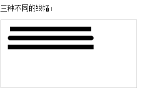
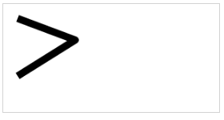

# HTML5

#### 目录
<ol>
    <li><a href="#canvas">Canvas</a>
      <ul>
          <li><a href="#canvas-1">线条</a>
            <ul>
              <li><a href="#canvas-1.1">lineCap 线条样式</a></li>
              <li><a href="#canvas-1.1">lineJoin 线条交叉</a></li>
            </ul>
          </li>
          <li><a href="#canvas-2">Canvas宽高</a>
            <ul>
              <li><a href="#canvas-2.1">```<canvas>```里的宽高和css里的宽高</a></li>
              <li><a href="#canvas-2.2">```<canvas>```宽高设置</a></li>
            </ul>
          </li>
      </ul>
    </li>
    <li><a href="#canvas"></a></li>
</ol>

<a id="canvas-1"></a>
#### 线条

<a id="canvas-1"></a>
##### 线条样式
- lineCap 设置或返回线条末端线帽的样式。
- lineJoin 当两条线交汇时，设置或返回所创建边角的类型


```
//向线条的每个末端添加平直/圆形、正方形的边缘
context.lineCap="butt|round|square";
```
<a id="canvas-1.2"></a>
##### lineJoin 线条交叉


```
//斜角、圆角、尖角
context.lineJoin="bevel|round|miter";  
```
<a id="canvas-2"></a>
#### Canvas宽高
<a id="canvas-2.1"></a>
####  ```<canvas>```里的宽高和css里的宽高
删除```<canvas>```里的宽高，宽：400；高：300；写在```<style>```里的效果：

- 为什么两者的效果会不一样呢？
　　canvas跟其他标签一样，也可以通过css来定义样式。但这里需要注意的是：canvas的默认宽高为300px * 150px,在css中为canvas定义宽高，实际上把宽高为300px * 150px的画布进行了拉伸，如果在这样的情况下进行canvas绘图，你得到的图形可能就是变形的效果。所以，在canvas绘图时，应该在canvas标签里直接定义宽高。


<a id="canvas-2.2"></a>
####  ```<canvas>```宽高设置
- 分别用两种方式设置canvas的高度
```
$("#myCanvas").attr({
    "height": 300
});
```

```
console.log("canvas高度", $("#myCanvas").attr("height"), $("#myCanvas").attr("width"));
$("#myCanvas").attr({
    "height": 300
});
var height = $("#myCanvas").height(200);
console.log("canvas高度", height, $("#myCanvas").attr("height"), $("#myCanvas").attr("width"));

```
```
<canvas id="myCanvas" width="800" height="300" style="background: url(&quot;./images/keji.jpg&quot;) 0px 0px no-repeat; display: block; height: 200px;">你的浏览器居然不支持Canvas？！赶快换一个吧！！</canvas>
```
